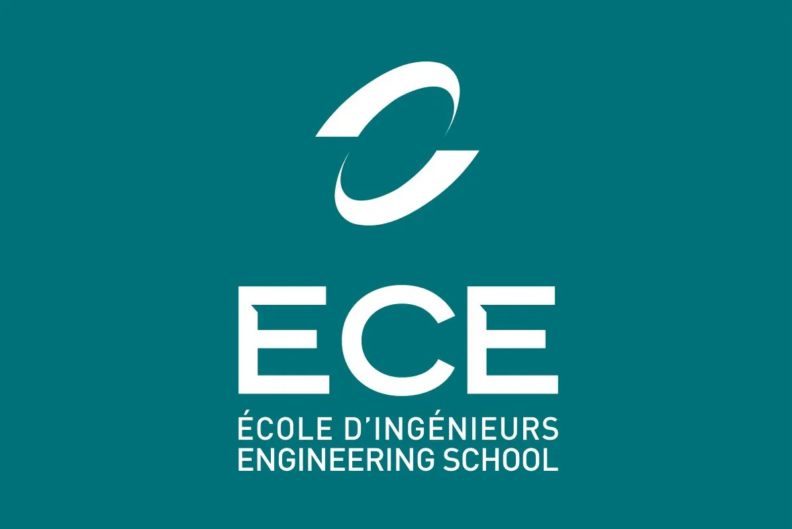

# Hi ! My name is Thibault GAREL 

  I am currently in my 4th year at 
  
    <strong>ECE</strong>
    
  
  , an engineering school, where I am pursuing a Major in <strong>Data & AI😊 </strong>.

Since 2022, I’ve been building personal projects mostly on **AI** 🤖. 

I'm looking for an **internship** in AI for 4 months starting **April 13, 2026**!

| 💼 [LinkedIn](https://www.linkedin.com/in/thibaultgarel/) | 📬 [Contact](mailto:thibault.garel@edu.ece.fr) |

---

## 🌟 Featured Projects

| Domain                      | Subdomain / Project                                                                                                                                                                                                                                                                                                                                                                                                                                                                                                                                                                                                                                                              | Link                                                                                                                                                                                                                                                                                                                                                                                                                                                                                                                                                                                                                                                                                                    |
|-----------------------------|----------------------------------------------------------------------------------------------------------------------------------------------------------------------------------------------------------------------------------------------------------------------------------------------------------------------------------------------------------------------------------------------------------------------------------------------------------------------------------------------------------------------------------------------------------------------------------------------------------------------------------------------------------------------------------|---------------------------------------------------------------------------------------------------------------------------------------------------------------------------------------------------------------------------------------------------------------------------------------------------------------------------------------------------------------------------------------------------------------------------------------------------------------------------------------------------------------------------------------------------------------------------------------------------------------------------------------------------------------------------------------------------------|
| **Generative AI**           | Image Generator - GAN (Generative Adversarial Network)    LMs - Language Models (Bigram & Transformer Models)      RAG - Retrieval Augmented Generation - A chatBot that read a PDF                                                                                                                                                                                                                                                                                                                                                                                                                                                                                  | [GAN](https://github.com/Thibault-GAREL/Image_generator_GAN)    [LMs](https://github.com/Thibault-GAREL/Language_Models)    [RAG](https://github.com/Thibault-GAREL/RAG_pdf)                                                                                                                                                                                                                                                                                                                                                                                                                                                                                                                |
| **Neural Networks**         | Neural Networks library (from Scratch in C)                                                                                                                                                                                                                                                                                                                                                                                                                                                                                                                                                                                                                                      | [Neural Networks](https://github.com/Thibault-GAREL/Neural_Network_from_Scratch)                                                                                                                                                                                                                                                                                                                                                                                                                                                                                                                                                                                                                        |
| **Reinforcement Learning**  | <u>Genetic Algorithm:</u>    &nbsp;&nbsp;&nbsp;&nbsp;<i> → Snake    &nbsp;&nbsp;&nbsp;&nbsp;<i> → Driving    &nbsp;&nbsp;&nbsp;&nbsp;<i> → AI learning to walk with an entier physique engine (box2D)    <u> Deep Q-Learning: </u>    &nbsp;&nbsp;&nbsp;&nbsp;<i> → Snake  (**🚧Still in progress !🚧**)    &nbsp;&nbsp;&nbsp;&nbsp;<i> → Driving    <u>Q-Learning</u> (To find the best way)    <u> PPO : </u>    &nbsp;&nbsp;&nbsp;&nbsp;<i> → Unity AI that learn to move    &nbsp;&nbsp;&nbsp;&nbsp;<i> → Unity AI that learn to catch money    &nbsp;&nbsp;&nbsp;&nbsp;<i> → Unity AI that learn to drive |    [Snake AI - GA](https://github.com/Thibault-GAREL/AI_snake_genetic_version)    [Driving AI - GA](https://github.com/Thibault-GAREL/AI_driving_genetic_version)    [Walking AI - GA](https://github.com/Thibault-GAREL/test_box2D_pygame)      [Snake AI - DQL](https://github.com/Thibault-GAREL/AI_snake_DQN_version)    [Driving AI - DQL](https://github.com/Thibault-GAREL/AI_driving_DQN_version)    [Q-Learning](https://github.com/Thibault-GAREL/Q-Learning)      [Unity move](https://github.com/Thibault-GAREL)    [Unity greedy](https://github.com/Thibault-GAREL)    [Unity drive](https://github.com/Thibault-GAREL) |
| **Speech Recognition**      | School project - ASR - Automatic Speech Recognition                                                                                                                                                                                                                                                                                                                                                                                                                                                                                                                                                                                                                              | [ASR](https://github.com/Thibault-GAREL/Speech_recognition)                                                                                                                                                                                                                                                                                                                                                                                                                                                                                                                                                                                                                                             |
| **Robotics**                | Two-wheeled robot controlled by a chatbot RAG                                                                                                                                                                                                                                                                                                                                                                                                                                                                                                                                                                                                                                    | [Bot controlled by ChatBot](https://github.com/Thibault-GAREL/Bot_controlled_by_a_Chatbot_RAG)                                                                                                                                                                                                                                                                                                                                                                                                                                                                                                                                                                                                          |
| **Games** (for training AI) | Snake game    Driving game    Natural Selection Simulation Engine                                                                                                                                                                                                                                                                                                                                                                                                                                                                                                                                                                                                    | [Snake game](https://github.com/Thibault-GAREL/snake_game)    [Driving game](https://github.com/Thibault-GAREL/driving_game)    [Human Sandbox](https://github.com/Thibault-GAREL/human_sandbox)                                                                                                                                                                                                                                                                                                                                                                                                                                                                                            |
| **Physics Simulation**      | Gravity simulation 2D    Attraction repulsion simulation                                                                                                                                                                                                                                                                                                                                                                                                                                                                                                                                                                                                                   | [Gravity Simulation](https://github.com/Thibault-GAREL/gravity_simulation)    [Attraction / Repulsion](https://github.com/Thibault-GAREL/Attraction_repulsion)                                                                                                                                                                                                                                                                                                                                                                                                                                                                                                                                    |
| **n8n project**             | My own local AI reachable on Whatsapp    An automatic and smart sorting of my mail with labellisation                                                                                                                                                                                                                                                                                                                                                                                                                                                                                                                                                                      | [WhatsApp AI](https://github.com/Thibault-GAREL/n8n_Whatsapp_LLM)    [Smart Mail labeling](https://github.com/Thibault-GAREL/)                                                                                                                                                                                                                                                                                                                                                                                                                                                                                                                                                                    |
| **Data analysis**           | ISS data analysis with Spark                                                                                                                                                                                                                                                                                                                                                                                                                                                                                                                                                                                                                                                     | [ISS analysis in real time](https://github.com/Thibault-GAREL/ISS_analysis_in_real_time)                                                                                                                                                                                                                                                                                                                                                                                                                                                                                                                                                                                                                |

---

## Project in group

| Domain                                                                                                                    | Subdomain / Project                                                    | Link                                                                                                                                              |
|---------------------------------------------------------------------------------------------------------------------------|------------------------------------------------------------------------|---------------------------------------------------------------------------------------------------------------------------------------------------|
| **[Hackaton with the CND](https://www.linkedin.com/feed/update/urn:li:activity:7397600929350336512/) (3rd / 15 schools)** | An AI able to find anomalies and breakdowns in logs of the French army | [Code Frontend](https://github.com/Rqbln/dirisi25-hackathon-frontend)    [Code Backend](https://github.com/Rqbln/dirisi25-hackathon-backend) |

---

## 🛠️ Skills & Tools

- **Languages**:  
    

- **Web**:  
   

- **Libraries**:  
    

- **Visualization**:  
    

- **Other**:  
        

---

## 🔍 Things I have to change :
- Add the other project in python :
    - ML Project : logistic regression / Classification
    - Practical exercises to learn pattern recognition (practices 8 to 10)
    - ChatBot Speech-to-speech (Speech-to-text => LLM => Text-to-speech)
    - My différent unity project of robotics

---

## 🚀 Next Steps
- Finish the Snake game using Deep Q-learning (hyperparameters don't work !!!) [Snake AI - DQL](https://github.com/Thibault-GAREL/AI_snake_genetic_version)  
- Finish the [Walking AI - GA](https://github.com/Thibault-GAREL/test_box2D_pygame)
- Develop a voice cloner to achieve end-to-end speech-to-speech synthesis from scratch (Speech→text (done!), text→text (done!), and text→speech (in progress)) <!-- Add links to projects -->

---

Code created by me 😎, Thibault GAREL - [Github](https://github.com/Thibault-GAREL)

Feel free to contact me ! 😊

| 💼 [LinkedIn](https://www.linkedin.com/in/thibaultgarel/) | 📬 [Contact](mailto:thibault.garel@edu.ece.fr) |
 
