# Hi ! My name is Thibault GAREL

I am currently in my 4th year at **ECE**, an engineering school, where I am pursuing a Major in **Data & AI**😊 .

Since 2023, I’ve been building personal projects mostly on **AI** 🤖.

I'm a **AI maker** in [Intelligence Lab](https://www.ece.fr/intelligence-lab/), where I participate in applied projects combining research, prototyping and innovation!

 

  
  &nbsp;&nbsp;
  
  &nbsp;&nbsp;
  
  &nbsp;&nbsp;
  

---

## **✨ Featured Projects**

<h3 align="center">🤖 Generative AI</h3>

---

<a href="https://github.com/Thibault-GAREL/Image_generator_GAN">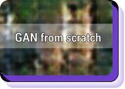<picture><source media="(prefers-color-scheme: light)" srcset="badges/cards/gen_ai_gan_light.svg"/>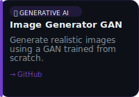</picture></a>&emsp;<a href="https://github.com/Thibault-GAREL/Language_Models">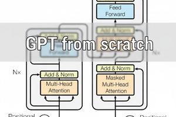<picture><source media="(prefers-color-scheme: light)" srcset="badges/cards/gen_ai_lm_light.svg"/>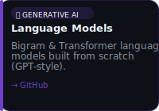</picture></a>  
<a href="https://github.com/Thibault-GAREL/RAG_pdf"><picture><source media="(prefers-color-scheme: dark)" srcset="Logo_Featured_Projects/gen_ai_rag_dark.gif"/>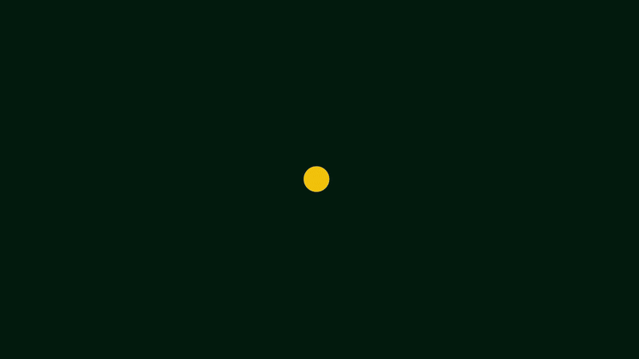</picture><picture><source media="(prefers-color-scheme: light)" srcset="badges/cards/gen_ai_rag_light.svg"/>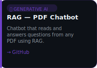</picture></a>&emsp;<a href="https://github.com/Thibault-GAREL/CLIP_Embedding_Tools">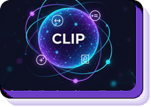<picture><source media="(prefers-color-scheme: light)" srcset="badges/cards/gen_ai_clip_light.svg"/>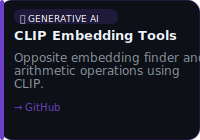</picture></a>

<h3 align="center">🧠 Neural Networks</h3>

---

<a href="https://github.com/Thibault-GAREL/Neural_Network_from_Scratch"><picture><source media="(prefers-color-scheme: dark)" srcset="Logo_Featured_Projects/neural_net_from_scratch_dark.gif"/>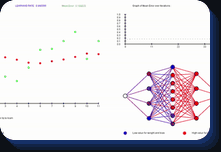</picture><picture><source media="(prefers-color-scheme: light)" srcset="badges/cards/neural_scratch_light.svg"/>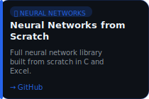</picture></a>

<h3 align="center">🎮 Reinforcement Learning</h3>

---

#### **🌳 Decision Tree**

<a href="https://github.com/Thibault-GAREL/AI_snake_decision_tree_version"><picture><source media="(prefers-color-scheme: dark)" srcset="Logo_Featured_Projects/rl_snake_decision_tree_dark.gif"/>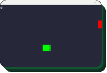</picture><picture><source media="(prefers-color-scheme: light)" srcset="badges/cards/rl_snake_dt_light.svg"/>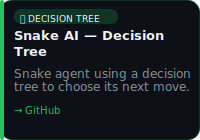</picture></a>

#### **🧬 Genetic Algorithm**

<a href="https://github.com/Thibault-GAREL/AI_snake_genetic_version"><picture><source media="(prefers-color-scheme: dark)" srcset="Logo_Featured_Projects/rl_snake_genetic_dark.gif"/>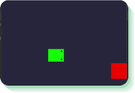</picture><picture><source media="(prefers-color-scheme: light)" srcset="badges/cards/rl_snake_ga_light.svg"/>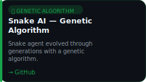</picture></a>&emsp;<a href="https://github.com/Thibault-GAREL/AI_driving_genetic_version"><picture><source media="(prefers-color-scheme: dark)" srcset="Logo_Featured_Projects/rl_driving_genetic_dark.gif"/>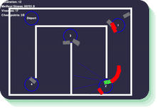</picture><picture><source media="(prefers-color-scheme: light)" srcset="badges/cards/rl_driving_ga_light.svg"/>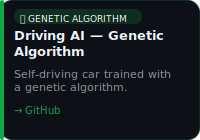</picture></a>  
<a href="https://github.com/Thibault-GAREL/test_box2D_pygame">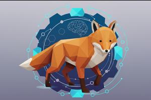<picture><source media="(prefers-color-scheme: light)" srcset="badges/cards/rl_walking_ga_light.svg"/>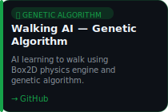</picture></a>

#### **📈 Q-Learning**

<a href="https://github.com/Thibault-GAREL/Q-Learning"><picture><source media="(prefers-color-scheme: dark)" srcset="Logo_Featured_Projects/rl_q_learning_dark.gif"/>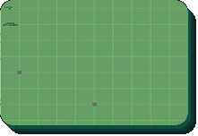</picture><picture><source media="(prefers-color-scheme: light)" srcset="badges/cards/rl_q_learning_light.svg"/>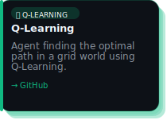</picture></a>&emsp;<a href="https://github.com/Thibault-GAREL/AI_snake_DQN_version"><picture><source media="(prefers-color-scheme: dark)" srcset="Logo_Featured_Projects/rl_snake_dql_dark.gif"/>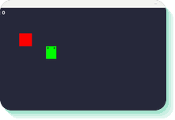</picture><picture><source media="(prefers-color-scheme: light)" srcset="badges/cards/rl_snake_dql_light.svg"/>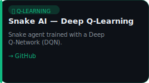</picture></a>  
<a href="https://github.com/Thibault-GAREL/AI_driving_DQN_version"><picture><source media="(prefers-color-scheme: dark)" srcset="Logo_Featured_Projects/rl_driving_dql_dark.gif"/>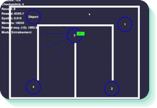</picture><picture><source media="(prefers-color-scheme: light)" srcset="badges/cards/rl_driving_dql_light.svg"/>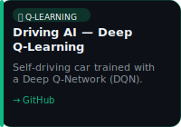</picture></a>

#### **🎯 PPO**

<a href="https://github.com/Thibault-GAREL/AI_snake_PPO_version"><picture><source media="(prefers-color-scheme: dark)" srcset="Logo_Featured_Projects/rl_snake_ppo_dark.gif"/>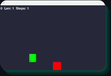</picture><picture><source media="(prefers-color-scheme: light)" srcset="badges/cards/rl_snake_ppo_light.svg"/>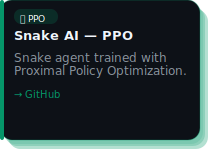</picture></a>&emsp;<a href="https://github.com/Thibault-GAREL/AI-StarCraft2-VLM-RL"><picture><source media="(prefers-color-scheme: dark)" srcset="Logo_Featured_Projects/rl_starcraft2_dark.gif"/>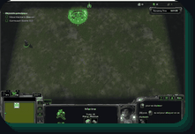</picture><picture><source media="(prefers-color-scheme: light)" srcset="badges/cards/rl_sc2_light.svg"/>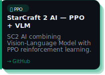</picture></a>

#### **🎮 Unity ML-Agents**

<a href="https://github.com/Thibault-GAREL/Unity_move"><picture><source media="(prefers-color-scheme: dark)" srcset="Logo_Featured_Projects/rl_unity_move_dark.gif"/>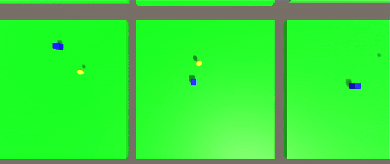</picture><picture><source media="(prefers-color-scheme: light)" srcset="badges/cards/rl_unity_move_light.svg"/>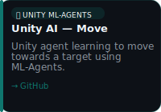</picture></a>&emsp;<a href="https://github.com/Thibault-GAREL/Unity_greedy"><picture><source media="(prefers-color-scheme: dark)" srcset="Logo_Featured_Projects/rl_unity_greedy_dark.gif"/>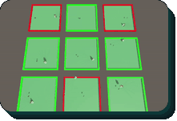</picture><picture><source media="(prefers-color-scheme: light)" srcset="badges/cards/rl_unity_greedy_light.svg"/>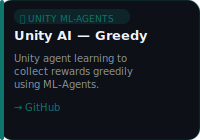</picture></a>  
<a href="https://github.com/Thibault-GAREL/Unity_drive"><picture><source media="(prefers-color-scheme: dark)" srcset="Logo_Featured_Projects/rl_unity_drive_dark.gif"/>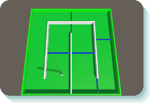</picture><picture><source media="(prefers-color-scheme: light)" srcset="badges/cards/rl_unity_drive_light.svg"/>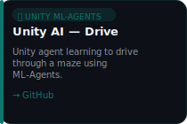</picture></a>

<h3 align="center">🎙️ Speech Recognition</h3>

---

<a href="https://github.com/Thibault-GAREL/Speech_recognition">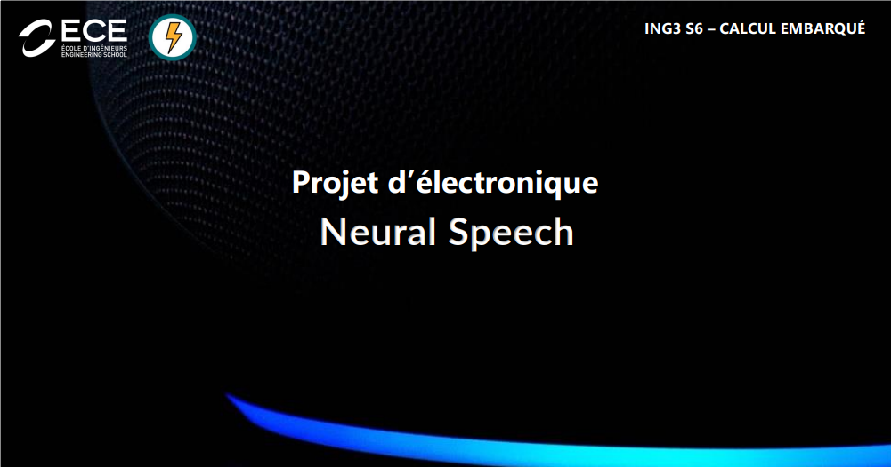<picture><source media="(prefers-color-scheme: light)" srcset="badges/cards/speech_asr_light.svg"/>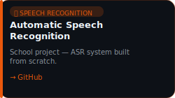</picture></a>

<h3 align="center">🦾 Robotics</h3>

---

<a href="https://github.com/Thibault-GAREL/Bot_controlled_by_a_Chatbot_RAG"><picture><source media="(prefers-color-scheme: dark)" srcset="Logo_Featured_Projects/robotics_chatbot_bot_dark.gif"/>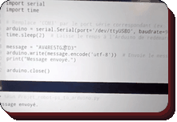</picture><picture><source media="(prefers-color-scheme: light)" srcset="badges/cards/robotics_bot_light.svg"/>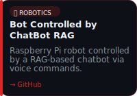</picture></a>

<!-- 

<h3>🗂️ Projets Annexes (click me)</h3>
 -->

<h3 align="center">🕹️ Games</h3>

---

<a href="https://github.com/Thibault-GAREL/snake_game"><picture><source media="(prefers-color-scheme: dark)" srcset="Logo_Featured_Projects/game_snake_dark.gif"/>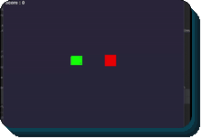</picture><picture><source media="(prefers-color-scheme: light)" srcset="badges/cards/game_snake_light.svg"/>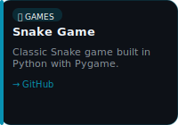</picture></a>&emsp;<a href="https://github.com/Thibault-GAREL/driving_game"><picture><source media="(prefers-color-scheme: dark)" srcset="Logo_Featured_Projects/game_driving_dark.gif"/>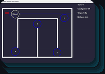</picture><picture><source media="(prefers-color-scheme: light)" srcset="badges/cards/game_driving_light.svg"/>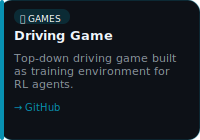</picture></a>  
<a href="https://github.com/Thibault-GAREL/human_sandbox"><picture><source media="(prefers-color-scheme: dark)" srcset="Logo_Featured_Projects/game_human_sandbox_dark.gif"/></picture><picture><source media="(prefers-color-scheme: light)" srcset="badges/cards/game_sandbox_light.svg"/>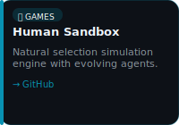</picture></a>&emsp;<a href="https://github.com/Thibault-GAREL/Game_ECE_World_Minigame">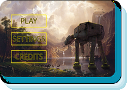<picture><source media="(prefers-color-scheme: light)" srcset="badges/cards/game_starwars_light.svg"/>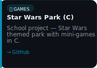</picture></a>  
<a href="https://github.com/Thibault-GAREL/Game_maze_Asterix-Obelix">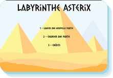<picture><source media="(prefers-color-scheme: light)" srcset="badges/cards/game_maze_light.svg"/>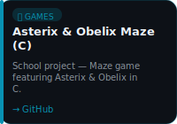</picture></a>

<h3 align="center">⚙️ Physics Simulation</h3>

---

<a href="https://github.com/Thibault-GAREL/gravity_simulation"><picture><source media="(prefers-color-scheme: dark)" srcset="Logo_Featured_Projects/physics_gravity_dark.gif"/>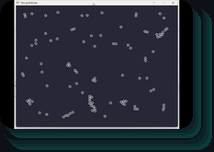</picture><picture><source media="(prefers-color-scheme: light)" srcset="badges/cards/physics_gravity_light.svg"/>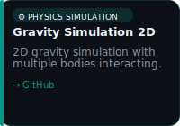</picture></a>&emsp;<a href="https://github.com/Thibault-GAREL/Attraction_repulsion"><picture><source media="(prefers-color-scheme: dark)" srcset="Logo_Featured_Projects/physics_attraction_repulsion_dark.gif"/>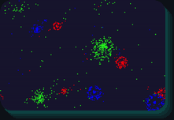</picture><picture><source media="(prefers-color-scheme: light)" srcset="badges/cards/physics_attraction_light.svg"/>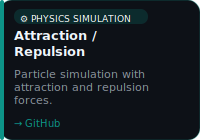</picture></a>  
<a href="https://github.com/Thibault-GAREL/2D-Muscular-Simulation"><picture><source media="(prefers-color-scheme: light)" srcset="badges/cards/physics_muscular_light.svg"/>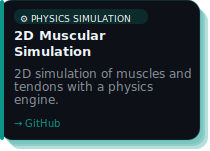</picture></a>

<h3 align="center">⚡ n8n Automation</h3>

---

<a href="https://github.com/Thibault-GAREL/n8n_Whatsapp_LLM">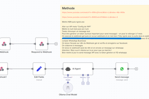<picture><source media="(prefers-color-scheme: light)" srcset="badges/cards/n8n_whatsapp_light.svg"/>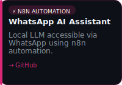</picture></a>&emsp;<a href="https://github.com/Thibault-GAREL/n8n_smart_mail_labeling">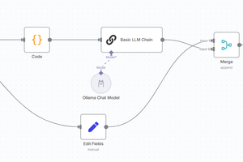<picture><source media="(prefers-color-scheme: light)" srcset="badges/cards/n8n_mail_light.svg"/>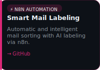</picture></a>

<h3 align="center">📊 Data Analysis</h3>

---

<a href="https://github.com/Thibault-GAREL/ISS_Analysis_Spark">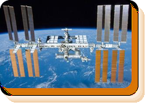<picture><source media="(prefers-color-scheme: light)" srcset="badges/cards/data_iss_light.svg"/>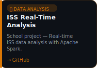</picture></a>

<!-- 
 -->

## **👥 Group Projects**

<a href="https://www.linkedin.com/feed/update/urn:li:activity:7397600929350336512/">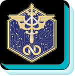<picture><source media="(prefers-color-scheme: light)" srcset="badges/cards/group_cnd_light.svg"/>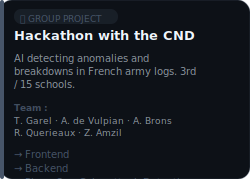</picture></a> 
&nbsp;&nbsp;&nbsp;&nbsp; 
&nbsp;&nbsp;

<a href="https://www.ece.fr/la-pedagogie-par-projets/">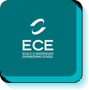<picture><source media="(prefers-color-scheme: light)" srcset="badges/cards/group_ppe_light.svg"/>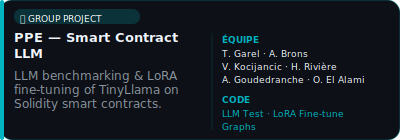</picture></a> 
&nbsp;&nbsp;&nbsp;&nbsp;&nbsp; 
&nbsp;&nbsp;

<a href="https://www.sustainableaicoalition.org/resilient-ai-challenge/">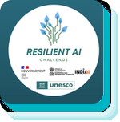<picture><source media="(prefers-color-scheme: light)" srcset="badges/cards/group_resilient_light.svg"/>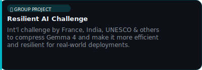</picture></a> 
&nbsp;&nbsp;&nbsp;&nbsp;&nbsp;&nbsp;&nbsp;*  

## **🛠️ Skills & Tools**

<table align="center">
  <tr>
    <td align="right" valign="middle" nowrap><b>Languages</b></td>
    <td valign="middle" width="100%">
      &nbsp;&nbsp;&nbsp;&nbsp;
      &nbsp;&nbsp;&nbsp;&nbsp;
      &nbsp;&nbsp;&nbsp;&nbsp;
      &nbsp;&nbsp;&nbsp;&nbsp;&nbsp;
      &nbsp;&nbsp;&nbsp;&nbsp;
      
    </td>
  </tr>
  <tr>
    <td align="right" valign="middle" nowrap><b>Web</b></td>
    <td valign="middle" width="100%">
      &nbsp;&nbsp;&nbsp;&nbsp;
      &nbsp;&nbsp;
      &nbsp;&nbsp;&nbsp;&nbsp;
      &nbsp;&nbsp;&nbsp;&nbsp;
      <a href="https://nextjs.org/" target="_blank"><picture><source media="(prefers-color-scheme: dark)" srcset="https://cdn.simpleicons.org/nextdotjs/ffffff"></picture></a>&nbsp;&nbsp;&nbsp;
      <a href="https://vercel.com/" target="_blank"><picture><source media="(prefers-color-scheme: dark)" srcset="https://cdn.simpleicons.org/vercel/ffffff"></picture></a>
    </td>
  </tr>
  <tr>
    <td align="right" valign="middle" nowrap><b>AI / ML</b></td>
    <td valign="middle" width="100%">
      &nbsp;&nbsp;&nbsp;
      &nbsp;&nbsp;&nbsp;&nbsp;
      <a href="https://scikit-learn.org/" target="_blank"><picture><source media="(prefers-color-scheme: dark)" srcset="https://cdn.simpleicons.org/scikitlearn/F7931E"></picture></a>&nbsp;&nbsp;&nbsp;&nbsp;
      <a href="https://numpy.org/" target="_blank"><picture><source media="(prefers-color-scheme: dark)" srcset="https://cdn.simpleicons.org/numpy/4DABCF"></picture></a>&nbsp;&nbsp;&nbsp;
      <a href="https://pandas.pydata.org/" target="_blank"><picture><source media="(prefers-color-scheme: dark)" srcset="https://cdn.simpleicons.org/pandas/E70488"></picture></a>&nbsp;&nbsp;&nbsp;
      <a href="https://www.langchain.com/" target="_blank"><picture><source media="(prefers-color-scheme: dark)" srcset="https://cdn.simpleicons.org/langchain/ffffff"></picture></a>
    </td>
  </tr>
  <tr>
    <td align="right" valign="middle" nowrap><b>Visualization</b></td>
    <td valign="middle" width="100%">
      &nbsp;&nbsp;&nbsp;
      &nbsp;&nbsp;&nbsp;&nbsp;
      &nbsp;&nbsp;&nbsp;
      &nbsp;&nbsp;&nbsp;
      
      <!--  -->
    </td>
  </tr>
  <tr>
    <td align="right" valign="middle" nowrap><b>Dev Tools</b></td>
    <td valign="middle" width="100%">
      &nbsp;&nbsp;&nbsp;&nbsp;
      <a href="https://github.com/" target="_blank"><picture><source media="(prefers-color-scheme: dark)" srcset="https://cdn.simpleicons.org/github/ffffff"></picture></a>&nbsp;&nbsp;&nbsp;
      &nbsp;&nbsp;&nbsp;&nbsp;
      <a href="https://ollama.com/" target="_blank"><picture><source media="(prefers-color-scheme: dark)" srcset="https://cdn.simpleicons.org/ollama/ffffff"></picture></a>&nbsp;&nbsp;&nbsp;
      &nbsp;&nbsp;&nbsp;
      
    </td>
  </tr>
  <tr>
    <td align="right" valign="middle" nowrap><b>Hardware</b></td>
    <td valign="middle" width="100%">
      &nbsp;&nbsp;&nbsp;&nbsp;
      &nbsp;&nbsp;
      &nbsp;&nbsp;&nbsp;&nbsp;
      <a href="https://www.espressif.com/en/products/socs/esp32" target="_blank"><picture><source media="(prefers-color-scheme: dark)" srcset="https://cdn.simpleicons.org/espressif/ffffff">
      </picture></a>&nbsp;&nbsp;&nbsp;&nbsp;&nbsp;
      
      &nbsp;
      
      
    </td>
  </tr>
</table>

<!-- Attention, les icones sont régler en fonction de leur taille réel ! Il faut bien le prendre en compte avant de modifier quoi que ce soit -->

---

## **📊 My GitHub Statistics**

<table width="100%">
  <tr>
    <td>
      <picture>
        <source media="(prefers-color-scheme: dark)" srcset="https://github-readme-stats.vercel.app/api?username=Thibault-GAREL&show_icons=true&theme=tokyonight&hide_border=true" />
        
      </picture>
    </td>
    <td>
      <picture>
        <source media="(prefers-color-scheme: dark)" srcset="https://github-profile-summary-cards.vercel.app/api/cards/most-commit-language?username=Thibault-GAREL&theme=tokyonight" />
        
      </picture>
    </td>
  </tr>
  <tr>
    <td colspan="2" align="center">
      <picture>
        <source media="(prefers-color-scheme: dark)" srcset="https://streak-stats.demolab.com?user=Thibault-GAREL&theme=tokyonight&hide_border=true" />
        
      </picture>
    </td>
  </tr>
  <tr>
    <td colspan="2" align="center">
      <picture>
        <source media="(prefers-color-scheme: dark)" srcset="https://github-profile-summary-cards.vercel.app/api/cards/profile-details?username=Thibault-GAREL&theme=tokyonight" />
        
      </picture>
    </td>
  </tr>
</table>

&nbsp;&nbsp;&nbsp;&nbsp;

&nbsp;&nbsp;&nbsp;&nbsp;
&nbsp;&nbsp;

&nbsp;&nbsp;&nbsp;&nbsp;&nbsp;&nbsp;&nbsp;&nbsp;&nbsp;&nbsp;

&nbsp;&nbsp;&nbsp;&nbsp;&nbsp;&nbsp;&nbsp;&nbsp;&nbsp;&nbsp;

Feel free to <a href="mailto:thibault.garel@edu.ece.fr">contact</a> me 📬 ! 😊

